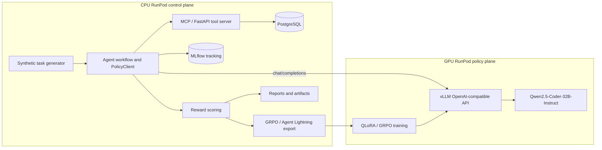

# RunPod CPU/GPU Architecture Validation Checklist

This checklist captures the intended two-plane architecture and the concrete validation points used to confirm whether the CPU RunPod repository is ready to run against the GPU-hosted Qwen policy service.

## Intended architecture

The system is split into a **CPU control plane** and a **GPU policy plane**. The CPU plane owns orchestration, data generation, profiling, SQL/data access, experiment tracking, trajectory scoring, dataset preparation, and comparison reports. The GPU plane owns heavyweight language-model inference and policy training. The two planes communicate through an **OpenAI-compatible HTTP API** served by vLLM on the GPU pod.

## CPU-plane validation criteria

| Component | Expected state | Validation command or signal |
|---|---|---|
| Repository source | Source files present without requiring packaged dependencies in Git archive | `find src scripts docs config -type f` |
| CPU Python stack | Imports for FastAPI, SQLAlchemy, MLflow, DVC, pandas/pyarrow, scikit-learn, XGBoost, LightGBM, and requests succeed | `scripts/cpu/validate_architecture.sh` |
| MCP server | Service is reachable on `MCP_URL` or `http://127.0.0.1:8090` and profile endpoint can read a generated parquet file | `scripts/cpu/start_mcp_server.sh` plus `scripts/cpu/validate_architecture.sh` |
| MLflow | Tracking service or local file store is available | `scripts/cpu/start_mlflow.sh` plus `scripts/cpu/validate_architecture.sh` |
| PostgreSQL | `DATABASE_URL` resolves to a reachable PostgreSQL instance, either local or externally hosted | `scripts/cpu/start_postgres.sh` or an externally provisioned PostgreSQL service |
| Hosted synthetic data | `agentic_ml.synthetic_tasks` and `agentic_ml.synthetic_dataset_rows` are populated from `data/synthetic` | `DATABASE_URL=... scripts/cpu/load_synthetic_to_postgres.py` plus `scripts/cpu/validate_architecture.sh` |
| Synthetic data | Tasks and parquet datasets exist under `data/synthetic` | CPU smoke workflow outputs |
| Baseline trajectories | Rollouts exist under `trajectories/baseline` | `scripts/cpu/run_03_run_baseline_workflow.sh` |
| Scored trajectories | Reward-scored rollouts exist under `trajectories/scored` | `scripts/cpu/run_04_score_trajectories.sh` |
| GRPO dataset | Grouped rollouts exist under `data/grpo/grouped_rollouts.jsonl` | `scripts/cpu/run_05_prepare_grpo_dataset.sh` |
| Agent Lightning export | Transition export exists under `data/grpo/agent_lightning_transitions.jsonl` | `scripts/cpu/run_05b_export_agent_lightning_transitions.sh` |
| Comparison report | `reports/baseline_vs_rl_tuned.md` exists | `scripts/cpu/run_06_compare_baseline_vs_tuned.sh` |
| GPU policy endpoint | CPU pod can call the GPU vLLM `/models` and `/chat/completions` routes | `GPU_POLICY_BASE_URL=... scripts/cpu/validate_architecture.sh` |

## GPU-plane validation criteria

| Component | Expected state | Validation command or signal |
|---|---|---|
| Model | `Qwen/Qwen2.5-Coder-32B-Instruct` cached or downloadable with authorized Hugging Face access | vLLM startup logs |
| vLLM API | OpenAI-compatible API listening on GPU pod port `8000` | `GET /v1/models` |
| Served model alias | Client model id is `qwen2.5-coder-32b-instruct` unless overridden | `MODEL_NAME=qwen2.5-coder-32b-instruct` |
| CPU reachability | RunPod port proxy exposes the GPU service to the CPU pod | `https://<gpu-pod-public-id>-8000.proxy.runpod.net/v1` |

## Latest hosted PostgreSQL validation status

The repository source, CPU smoke workflow, MCP server, MLflow service, artifacts, and GPU Qwen endpoint have been validated. The previous local PostgreSQL gap is resolved by using the hosted Prisma PostgreSQL service through `DATABASE_URL`. The hosted schema `agentic_ml` contains `synthetic_tasks` and `synthetic_dataset_rows`, loaded from the repository synthetic metadata and parquet files. Runtime deployments should set `DATABASE_URL` and `POSTGRES_SCHEMA=agentic_ml` in the CPU pod environment before starting the MCP server or running `scripts/cpu/validate_architecture.sh`.

## Source-only packaging rule

The Git-ready archive should include source, configuration, scripts, and documentation only. It should exclude virtual environments, caches, model weights, MLflow runs, PostgreSQL data directories, generated artifacts, logs, and large benchmark outputs.
