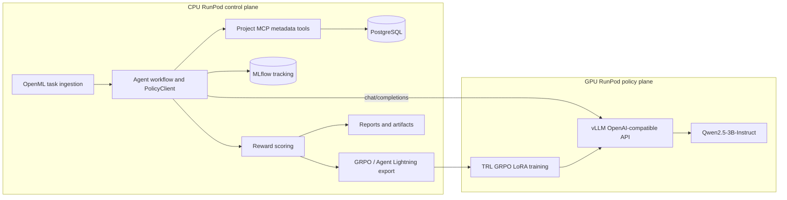

# RunPod CPU/GPU Architecture Validation Checklist

This checklist captures the intended two-plane architecture and the concrete validation points used to confirm whether the RunPod repository is ready to run the OpenML PostgreSQL Track A / TRL GRPO Track B loop.

## Intended architecture

The system is split into a **CPU control plane** and a **GPU policy plane**. The CPU plane owns OpenML ingestion, PostgreSQL/MCP metadata access, orchestration, profiling, experiment tracking, trajectory scoring, dataset preparation, and comparison reports. The GPU plane owns heavyweight language-model inference and policy training. The two planes communicate through an **OpenAI-compatible HTTP API** served by vLLM or the local validation server.

## CPU-plane validation criteria

| Component | Expected state | Validation command or signal |
|---|---|---|
| Repository source | Source files present without requiring packaged dependencies in Git archive | `find src scripts docs config -type f` |
| CPU Python stack | Imports for FastAPI, SQLAlchemy, MLflow, DVC, pandas/pyarrow, scikit-learn, XGBoost, LightGBM, and requests succeed | `scripts/cpu/validate_architecture.sh` |
| MCP server | Service is reachable on `MCP_URL` or `http://127.0.0.1:8090` and profile endpoint can read a generated parquet file | `scripts/cpu/start_mcp_server.sh` plus `scripts/cpu/validate_architecture.sh` |
| MLflow | Tracking service or local file store is available | `scripts/cpu/start_mlflow.sh` plus `scripts/cpu/validate_architecture.sh` |
| PostgreSQL | `DATABASE_URL` resolves to a reachable PostgreSQL instance, either local or externally hosted | `scripts/cpu/start_postgres.sh` or an externally provisioned PostgreSQL service |
| Hosted OpenML registry | `ml_registry.real_benchmark_tasks`, `ml_registry.real_dataset_summaries`, and `ml_execution.dataset_sources` are populated | `scripts/ingest_openml_to_postgres.py` through `scripts/runpod_bootstrap_e2e.sh` |
| Track A trajectories | Rollouts exist under `trajectories/tracka_initial` | `scripts/runpod_bootstrap_e2e.sh` or `python -m src.agents.supervisor` |
| Scored Track A trajectories | Reward-scored rollouts exist under `trajectories/tracka_initial_scored` | `python -m src.rewards.scorer` |
| GRPO dataset | Grouped rollouts exist under `data/grpo/grouped_rollouts.jsonl` | `python -m src.training.prepare_grpo_dataset` |
| Agent Lightning export | Transition export exists under `data/grpo/agent_lightning_transitions.jsonl` | `scripts/cpu/run_05b_export_agent_lightning_transitions.sh` |
| Comparison report | `reports/tracka_initial_vs_baseline_vs_trackb_redeploy.md` exists when `RUN_LIVE_POLICY=1` | `scripts/runpod_bootstrap_e2e.sh` |
| GPU policy endpoint | CPU pod can call the GPU vLLM `/models` and `/chat/completions` routes | `GPU_POLICY_BASE_URL=... scripts/cpu/validate_architecture.sh` |

## GPU-plane validation criteria

| Component | Expected state | Validation command or signal |
|---|---|---|
| Model | `Qwen/Qwen2.5-3B-Instruct` cached or downloadable with authorized Hugging Face access | vLLM/local server startup logs |
| vLLM API | OpenAI-compatible API listening on GPU pod port `8000` | `GET /v1/models` |
| Served model alias | Client model id matches the configured policy model unless overridden | `MODEL_NAME=Qwen/Qwen2.5-3B-Instruct` |
| CPU reachability | RunPod port proxy exposes the GPU service to the CPU pod | `https://<gpu-pod-public-id>-8000.proxy.runpod.net/v1` |

## Latest hosted PostgreSQL validation status

The repository source, OpenML ingestion path, strict MCP boundary, Track A rollouts, Track B TRL GRPO launcher, Streamlit dashboard, and committed evidence files have been validated. Runtime deployments should set `DATABASE_URL` before running `scripts/runpod_bootstrap_e2e.sh`. Set `HF_TOKEN` or `HUGGINGFACE_HUB_TOKEN` when the selected model requires Hugging Face authentication.

## Source-only packaging rule

The Git-ready archive should include source, configuration, scripts, and documentation only. It should exclude virtual environments, caches, model weights, MLflow runs, PostgreSQL data directories, generated artifacts, logs, and large benchmark outputs.
