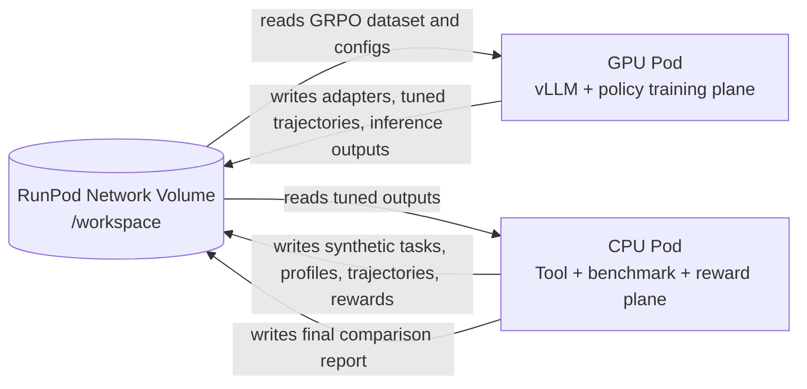

# RunPod CPU/GPU Setup and Connection Guide

**Author:** Manus AI  
**Date:** May 30, 2026

## Executive answer

Yes, after creating the RunPod pod, you should connect to it and work with the codebase on the pod, typically under `/workspace/self-improving-ml-agent`. For this project, the recommended workflow is to use **SSH plus VS Code Remote-SSH** for real implementation work and reproducible script execution. Use **JupyterLab** mainly for notebook-style inspection, quick debugging, and data exploration. RunPod documents four connection options—web terminal, SSH, JupyterLab, and VS Code/Cursor—and explicitly positions SSH as best for reliable long-running access, JupyterLab as best for notebooks, and VS Code/Cursor as best for a full development environment.[1]

The best deployment layout is to create a **RunPod Network Volume first**, attach it to the CPU pod when running the CPU/tool plane, and attach the same volume to the GPU pod when running model inference or training. RunPod network volumes are persistent storage independent of compute resources, and for pods they typically mount at `/workspace`; RunPod also notes that network volumes must be attached during pod deployment and cannot be attached later without deleting the pod.[2]

| Question | Practical answer for this repository |
|---|---|
| Should I SSH to the pod? | **Yes.** Use SSH for reliable terminal execution and for VS Code Remote-SSH. Add your SSH public key to RunPod before pod creation whenever possible.[3] |
| Should I use VS Code? | **Yes, for coding.** Use VS Code Remote-SSH or Cursor Remote-SSH to edit files directly on `/workspace` and run scripts in the integrated terminal.[4] |
| Should I use JupyterLab? | **Use it for exploration, not as the main pipeline runner.** It is useful for inspecting data, profiles, metrics, and notebooks, but the reproducible workflow should remain the shell scripts in `scripts/cpu` and `scripts/gpu`.[1] |
| Should CPU and GPU pods share storage? | **Yes.** Use one RunPod Network Volume mounted at `/workspace` so CPU outputs such as trajectories and GRPO datasets are visible to the GPU pod, and GPU outputs such as adapters/checkpoints are visible to the CPU comparison stage.[2] |
| Should both pods run at the same time? | Usually **no** for the MVP. Run CPU stages, stop the CPU pod, start the GPU pod on the same volume, then return to CPU for final comparison. This avoids accidental concurrent writes and controls cost. |

## What I implemented from the latest feedback

The feedback said the previous repository was architecture-aligned but still too much of a scaffold. I therefore implemented the highest-value Track A pieces that can be validated before moving to a full GPU RL run. The repository now contains real CPU-plane tabular benchmarking, evidence-based reward components, guardrail validation, profile-driven preprocessing, and improved experiment tracking.

| Feedback item | Implementation status | Main files changed or added |
|---|---:|---|
| Real GBM benchmarking rather than a stub | Implemented | `src/tools/gbm_benchmark.py`, `src/agents/sandbox_execution.py` |
| Profile-driven preprocessing | Implemented | `src/agents/data_engineer.py`, `src/tools/ydata_profiler.py` |
| High-cardinality-aware benchmark planning | Implemented | `src/agents/gradient_boosting_specialist.py` |
| Real MLflow-compatible experiment logging with fallback | Implemented | `src/tools/mlflow_dvc_tracker.py`, `src/agents/experiment_tracking.py` |
| Artifact and raw-data-leakage guardrails | Implemented | `src/governance/guardrails.py`, `src/agents/reviewer.py` |
| Stronger reward scoring | Implemented | `src/rewards/scorer.py` |
| Multiple rollouts per task | Implemented | `scripts/cpu/run_03_run_baseline_workflow.sh`, `src/agents/supervisor.py` |
| Docker execution path with local fallback | Implemented | `src/tools/dockerized_code_interpreter.py` |

The updated validation run compiled the source tree, generated synthetic tasks, executed two tasks with two rollouts per task, trained/evaluated tabular benchmark models, wrote champion metadata, approved guardrail review reports, and rescored the trajectories. The latest smoke test produced four scored trajectories with rewards around **0.89–0.91**, including nonzero reward components for data quality, model quality, tracking, sandbox execution, reproducibility, and guardrail compliance. The validation evidence is saved in `reports/feedback_validation_summary.txt`.

## Recommended RunPod architecture

The project should be deployed as a split control/training system rather than one large always-on GPU box. The **CPU pod** owns orchestration, profiling, preprocessing, benchmarking, experiment tracking, reward scoring, report generation, and optional PostgreSQL/MLflow services. The **GPU pod** owns vLLM policy serving, baseline/tuned batch inference, and LoRA/GRPO policy fine-tuning. RunPod’s own guidance says data processing can be CPU-focused or use an entry GPU, while LLM inference and fine-tuning generally require GPUs selected by VRAM and workload size.[5]

| Layer | RunPod resource | Repository responsibility | Suggested connection method |
|---|---|---|---|
| Shared storage | Network Volume mounted at `/workspace` | Repository, data, profiles, trajectories, MLflow fallback logs, DVC metadata, checkpoints, reports | Visible inside each attached pod |
| CPU/tool plane | CPU pod, or a low-cost GPU pod if CPU-only inventory is unavailable | `scripts/cpu/*`, PostgreSQL, MLflow, MCP server, GBM benchmark, scoring, evaluation | VS Code Remote-SSH for development; SSH terminal for runs; JupyterLab optional |
| GPU/policy plane | CUDA GPU pod, preferably official RunPod PyTorch template | `scripts/gpu/*`, vLLM server, baseline/tuned inference, QLoRA/GRPO training | VS Code Remote-SSH for code; SSH terminal for long jobs; JupyterLab optional |



## Step 1: Create the shared Network Volume

Create the network volume before creating either pod. In the RunPod console, go to **Storage**, choose **New Network Volume**, select a datacenter, name it something like `ml-agent-workspace`, and choose a starting size. A practical initial size is **100–250 GB** for this MVP, because it needs the repository, Python environments, generated data, model artifacts, and one or more base-model caches. RunPod notes that volume size can be increased later but not decreased, and network volumes for pods are selected during pod deployment.[2]

| Setting | Recommendation |
|---|---|
| Datacenter | Choose a datacenter with both CPU availability and the GPU type you expect to use. RunPod notes GPU options depend on the volume location when attaching a network volume to a pod.[2] |
| Size | Start with 100–250 GB for the MVP; increase before full model training if caching larger models. |
| Mount path | Expect `/workspace` inside pods. RunPod states network volumes replace the pod’s default volume disk, typically mounted at `/workspace`.[2] |
| Persistence | Treat `/workspace` as persistent and container disk as disposable. RunPod distinguishes network volume storage from temporary container disk.[5] |

## Step 2: Create and connect to the CPU pod

Deploy a CPU pod in the same datacenter as the network volume and attach the network volume during deployment. If a CPU-only pod option is unavailable in the console, use the least expensive suitable GPU pod as the CPU/tool plane and avoid running GPU-heavy tasks on it. The CPU pod does not need a large GPU because this stage is mostly tabular preprocessing, classical model benchmarking, JSON/Parquet I/O, MLflow metadata logging, and reward scoring.

Use a template that gives you Python, SSH, and preferably JupyterLab. Official RunPod PyTorch templates are convenient because RunPod states they include JupyterLab preconfigured and support SSH over exposed TCP for VS Code/Cursor workflows.[1] [4]

```bash
# Local machine, before creating pods if possible.
ssh-keygen -t ed25519 -f ~/.ssh/id_ed25519 -C "YOUR_EMAIL@DOMAIN.COM"
cat ~/.ssh/id_ed25519.pub
```

Paste the public key into RunPod account settings. RunPod recommends SSH key authentication and explains that keys added before pod startup can be injected automatically into the pod.[3] [4]

Once the CPU pod is running, connect by VS Code Remote-SSH or terminal SSH. In the RunPod pod detail page, open **Connect**, copy the SSH command, and connect. If you want VS Code Remote-SSH, copy the **SSH over exposed TCP** command; RunPod notes that VS Code/Cursor requires SSH over exposed TCP support, and official RunPod PyTorch templates support it.[4]

```bash
# Example only; copy your exact command from RunPod.
ssh root@POD_PUBLIC_IP -p POD_SSH_PORT -i ~/.ssh/id_ed25519
```

Inside the CPU pod, install and run the CPU environment:

```bash
cd /workspace
# Option A: unzip the archive delivered with this handoff.
unzip self-improving-ml-agent.zip
cd /workspace/self-improving-ml-agent

# Option B, later if you put it in GitHub:
# git clone YOUR_REPO_URL self-improving-ml-agent
# cd self-improving-ml-agent

python3 -m venv .venv-cpu
source .venv-cpu/bin/activate
python -m pip install --upgrade pip
pip install -r requirements-cpu.txt
cp .env.example .env
```

Run a CPU smoke test first:

```bash
export WORKSPACE_DIR=/workspace/self-improving-ml-agent
export TASK_COUNT=20
export TASK_LIMIT=2
export ROLLOUTS_PER_TASK=2

bash scripts/cpu/run_01_generate_synthetic.sh
bash scripts/cpu/run_03_run_baseline_workflow.sh
bash scripts/cpu/run_04_score_trajectories.sh
python scripts/dev_summarize_validation.py | tee reports/runpod_cpu_validation_summary.txt
```

For the fuller CPU stage, increase the task count and prepare the GRPO dataset for the GPU pod:

```bash
export TASK_COUNT=100
export TASK_LIMIT=25
export ROLLOUTS_PER_TASK=4

bash scripts/cpu/run_01_generate_synthetic.sh
bash scripts/cpu/run_03_run_baseline_workflow.sh
bash scripts/cpu/run_04_score_trajectories.sh
bash scripts/cpu/run_05_prepare_grpo_dataset.sh
```

If you want service-backed tracking and tool serving rather than the file-based smoke path, start these in separate terminals:

```bash
bash scripts/cpu/start_postgres.sh
bash scripts/cpu/start_mlflow.sh
bash scripts/cpu/start_mcp_server.sh
```

## Step 3: Stop the CPU pod before starting the GPU pod

For the first MVP run, stop the CPU pod after it writes `data/grpo/grouped_rollouts.jsonl`. Do not terminate the network volume. RunPod warns that terminating a pod deletes data not stored in a network volume, so keep the project under `/workspace` and confirm that important files are on the network volume before deleting any pod.[6]

Stopping the CPU pod is not strictly required, but it is safer and cheaper for the MVP because only one stage writes heavily at a time. The CPU and GPU pods can be recreated against the same network volume as long as the volume remains available in the selected datacenter.

## Step 4: Create and connect to the GPU pod

Deploy a GPU pod in the same datacenter and attach the same network volume. Use an official RunPod PyTorch CUDA template where possible. For a first run, select a GPU with enough VRAM for the base policy and adapter training. RunPod’s pod selection guide lists mid-range GPUs such as RTX 4090 or L4 for 7B–13B inference and high-end GPUs such as A100/H100 for LLM fine-tuning, with VRAM being the common bottleneck.[5] For this repository’s MVP policy path, a 24 GB GPU is enough for serving and small-model experiments, while full fine-tuning experiments are more comfortable on 40–80 GB GPUs.

Connect the same way as the CPU pod. Use VS Code Remote-SSH if you are editing scripts or training code, and use terminal SSH for long-running jobs. JupyterLab is helpful if you want to inspect the GRPO dataset or monitor artifacts interactively.

```bash
cd /workspace/self-improving-ml-agent
python3 -m venv .venv-gpu
source .venv-gpu/bin/activate
python -m pip install --upgrade pip
pip install -r requirements-gpu.txt

export WORKSPACE_DIR=/workspace/self-improving-ml-agent
export HF_HOME=/workspace/.cache/huggingface
export TRANSFORMERS_CACHE=/workspace/.cache/huggingface
```

Start baseline policy serving if you are ready to use vLLM/OpenAI-compatible inference. If you are only validating the handoff, you can run the current training placeholder first and replace it later with the full GRPO trainer.

```bash
# Terminal 1: start policy server.
bash scripts/gpu/start_baseline_inference.sh

# Terminal 2: run inference/training steps.
bash scripts/gpu/run_01_baseline_batch_inference.sh
bash scripts/gpu/run_02_train_policy_qlora_grpo.sh
bash scripts/gpu/start_tuned_inference.sh
bash scripts/gpu/run_03_tuned_batch_inference.sh
```

## Step 5: Return to CPU and create the final comparison report

After the GPU pod writes tuned-policy outputs or adapter metadata to `/workspace`, stop the GPU pod and restart the CPU pod with the same network volume. Then run the final comparison:

```bash
cd /workspace/self-improving-ml-agent
source .venv-cpu/bin/activate
export WORKSPACE_DIR=/workspace/self-improving-ml-agent
bash scripts/cpu/run_06_compare_baseline_vs_tuned.sh
```

The output report is written to `reports/baseline_vs_rl_tuned.md`. The validation summary from the feedback implementation pass is written to `reports/feedback_validation_summary.txt`.

## VS Code versus JupyterLab: final recommendation

VS Code Remote-SSH should be the default working mode because it gives you normal file editing, integrated terminals, Git support, remote extensions, and reliable execution against the actual `/workspace` files. RunPod’s VS Code/Cursor guide says Remote-SSH lets you work within pod volume directories as if files were local, and it instructs users to open the workspace directory, typically `/workspace`, after connecting.[4]

JupyterLab should be treated as a companion interface. It is excellent for opening a notebook, viewing a profile artifact, testing a small pandas operation, or inspecting model metrics. It is not the best place to own the production run because notebooks make it easy to run cells out of order. For this repository, keep the source of truth in scripts and files, then use JupyterLab for analysis and visualization when needed.

| Activity | Use VS Code Remote-SSH | Use terminal SSH | Use JupyterLab |
|---|---:|---:|---:|
| Editing Python modules | Yes | Possible, but less convenient | No |
| Running CPU/GPU shell scripts | Yes, integrated terminal | Yes, best for long jobs | Not recommended |
| Inspecting Parquet/JSON artifacts | Possible | Possible | Yes |
| Debugging notebooks | No | No | Yes |
| Long-running training | Possible with terminal multiplexer | Yes | No |
| Git commits and repo management | Yes | Yes | No |

## Common pitfalls to avoid

First, do not put the repository or generated artifacts only on the container disk. Use `/workspace`, because RunPod documents network volumes as persistent and container disk as temporary storage.[2] [5] Second, add your SSH public key before deploying pods if possible; if you add it after a pod is already running, RunPod notes you may need to redeploy or manually add the key to `~/.ssh/authorized_keys`.[4] Third, when reconnecting VS Code after stopping and resuming a pod, check whether the SSH port changed. RunPod warns that port numbers may change after stop/resume and the SSH config may need updating.[4]

Finally, do not leave costly pods running after the stage finishes. RunPod bills pods by the second for compute and storage, and the pricing guide distinguishes on-demand development/testing workloads from longer-running committed workloads.[7] Stop or terminate compute when not needed, but preserve the network volume until you have copied out the results you need.

## References

[1]: https://docs.runpod.io/pods/connect-to-a-pod "RunPod Documentation: Connection options"  
[2]: https://docs.runpod.io/storage/network-volumes "RunPod Documentation: Network volumes"  
[3]: https://docs.runpod.io/pods/configuration/use-ssh "RunPod Documentation: Connect to a Pod with SSH"  
[4]: https://docs.runpod.io/pods/configuration/connect-to-ide "RunPod Documentation: Connect to a Pod with VSCode or Cursor"  
[5]: https://docs.runpod.io/pods/choose-a-pod "RunPod Documentation: Choose a Pod"  
[6]: https://docs.runpod.io/get-started "RunPod Documentation: Deploy your first Pod"  
[7]: https://docs.runpod.io/pods/pricing "RunPod Documentation: Pricing"
