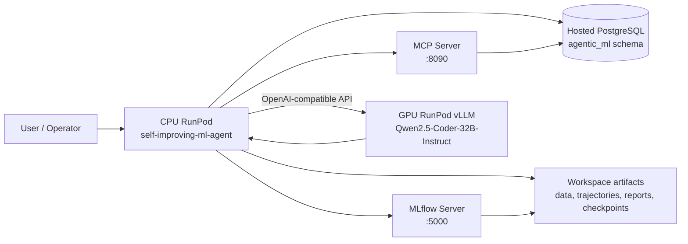

# RunPod CPU/GPU Architecture Validation Report

**Author:** Manus AI  
**Validation date:** 2026-05-31  
**Project:** Self-improving ML agent CPU/GPU RunPod deployment

## Executive summary

The architecture has now been validated against the intended split between a **CPU orchestration plane** and a **GPU inference plane**. The CPU RunPod remains responsible for workflow orchestration, MCP/FastAPI tools, MLflow tracking, data preparation, scoring, and training-data export. The GPU RunPod remains responsible for heavyweight Qwen2.5-Coder-32B-Instruct inference through the vLLM OpenAI-compatible API.

The previous blocking PostgreSQL gap has been resolved by using the hosted Prisma PostgreSQL service as the structured SQL state layer. The schema `agentic_ml` was created, `synthetic_tasks` and `synthetic_dataset_rows` were created, 20 synthetic task metadata records were loaded, and 20,000 dataset row payloads were loaded from the repository parquet files. A direct validation query confirmed that the hosted database row counts match the local synthetic dataset sources.

| Area | Intended role | Current status | Readiness |
|---|---|---|---:|
| CPU repository | Orchestrates synthetic data, agents, scoring, training-data export, and service integrations | Present and source-updated for hosted PostgreSQL and GPU vLLM defaults | Ready |
| MCP server | Provides tool endpoints for profiling and SQL-backed capabilities | Running on CPU pod in prior validation; SQL path now has hosted PostgreSQL backing once `DATABASE_URL` is exported | Ready after env reload |
| MLflow | Tracks runs and serves experiment metadata | Running on CPU pod in prior validation using file-backed `mlruns` | Ready for MVP |
| Hosted PostgreSQL | Stores structured synthetic/task data and supports SQL MCP tools | `agentic_ml.synthetic_tasks` has 20 rows; `agentic_ml.synthetic_dataset_rows` has 20,000 rows | Ready |
| GPU inference | Hosts Qwen2.5-Coder-32B-Instruct via OpenAI-compatible vLLM endpoint | Running on GPU pod and reachable from CPU pod through the `/v1` endpoint | Ready |
| CPU-to-GPU configuration | Lets CPU policy client call the GPU vLLM endpoint | Corrected to use the RunPod port-8000 `/v1` base URL | Ready |
| Runtime artifacts | Evidence that the baseline CPU path and GPU endpoint are usable | Synthetic data, trajectories, GRPO data, checkpoints, and comparison reports exist | Ready for MVP validation |

## Intended architecture

The validated architecture is a two-plane deployment. The **CPU pod** owns deterministic orchestration, data preparation, MCP tool endpoints, experiment tracking, reward scoring, SQL access, and export of training artifacts. The **GPU pod** owns large-model serving and exposes an OpenAI-compatible endpoint that the CPU workflow calls through the repository policy client.

This architecture is appropriate for the current MVP because the 32B model is isolated on GPU hardware while the CPU pod handles deterministic workflow execution, tool serving, service coordination, and database access. PostgreSQL is intentionally externalized as hosted state, which avoids relying on a pod-local database process and makes the SQL-backed MCP path reusable across pod restarts.

## Data-access design: MCP wrapper and clean interpreter data

The implemented design matches the intended separation between **agent-facing data access** and **code-interpreter execution data**. Agents should query structured state through MCP-backed tools or repository workflow APIs. The code-interpreter path should not receive arbitrary raw table dumps in prompt context; it should receive clean, path-addressed artifacts such as curated parquet files, schema metadata, profile summaries, and preprocessing configuration.

| Layer | Access pattern | Data contract | Current implementation status |
|---|---|---|---:|
| Agent / orchestration layer | Calls MCP/FastAPI endpoints and repository tools | SQL is mediated by `SQLAlchemyConnector`, which allows read-style SQL and now normalizes hosted PostgreSQL URLs | Wired |
| Hosted PostgreSQL | Stores task metadata and row payloads under `agentic_ml` | `synthetic_tasks` and `synthetic_dataset_rows` provide structured, queryable synthetic data | Loaded |
| Data engineer workflow | Produces clean artifacts from task datasets | Clean parquet, schema metadata, profile summary, and preprocessing config are the expected handoff | Present |
| Code interpreter | Executes benchmark/modeling code against artifact paths | Receives clean artifact paths rather than raw rows embedded in LLM prompts | Present |
| Guardrails | Checks for unsafe raw-row leakage and required metadata | The repository contains guardrail policy and workflow validation checks for artifact completeness and raw-row safety | Present |

In practical terms, the hosted database is the shared SQL state layer for MCP and agents, while the code-interpreter stage is fed from clean dataset artifacts. That means the self-improving agent loop can use SQL-backed metadata and dataset access without collapsing into uncontrolled prompt-level raw data exposure.

## Hosted PostgreSQL load validation

The hosted database was connected from the sandbox using the sensitive connection string supplied for the deployment. The connection details are intentionally omitted from this report. The loader created the schema and tables, upserted task metadata, loaded parquet row payloads, and validated counts against the repository source files.

| Validation item | Expected | Observed | Result |
|---|---:|---:|---:|
| Task metadata records | 20 | 20 | Passed |
| Distinct dataset task ids | 20 | 20 | Passed |
| Dataset row payloads | 20,000 | 20,000 | Passed |
| PostgreSQL schema | `agentic_ml` | `agentic_ml` | Passed |
| PostgreSQL version | Hosted PostgreSQL 17.x | PostgreSQL 17.2 reported by server | Passed |

The row-count expectation was derived from the actual parquet files in `data/synthetic/datasets`, whose row counts are 500, 750, 1,000, 1,250, and 1,500 repeated across 20 tasks. The earlier rough expectation of approximately 10,000 rows was superseded by this direct source-file validation.

## GPU inference endpoint status

The GPU pod is serving **Qwen2.5-Coder-32B-Instruct** through vLLM using an OpenAI-compatible API. The CPU-side environment should use the RunPod port-8000 proxy URL with the `/v1` suffix as the base URL.

| Variable | Runtime value pattern |
|---|---|
| `GPU_POLICY_BASE_URL` | `https://<gpu-pod-public-id>-8000.proxy.runpod.net/v1` |
| `BASELINE_POLICY_URL` | `https://<gpu-pod-public-id>-8000.proxy.runpod.net/v1/chat/completions` |
| `TUNED_POLICY_URL` | `https://<gpu-pod-public-id>-8000.proxy.runpod.net/v1/chat/completions` |
| `MODEL_NAME` | `qwen2.5-coder-32b-instruct` |
| `VLLM_MODEL_ID` | `Qwen/Qwen2.5-Coder-32B-Instruct` |

The `/v1` suffix matters because the OpenAI-compatible vLLM API exposes model discovery under `/v1/models` and chat inference under `/v1/chat/completions`.

## Source-level changes made

The repository was updated so the source tree now reflects the hosted PostgreSQL deployment and the validated CPU/GPU architecture. No secrets were committed; runtime secrets must be exported in the CPU pod environment.

| File | Purpose of update |
|---|---|
| `.env.example` | Added hosted Prisma PostgreSQL placeholder guidance, `POSTGRES_SCHEMA`, and connection-timeout settings without embedding credentials. |
| `config/settings.toml` | Added `postgres_schema` and `database_url_env` metadata for hosted database configuration. |
| `src/tools/sql_alchemy_connector.py` | Added PostgreSQL URL normalization for `postgres://` and `postgresql://`, enabled `pool_pre_ping`, added connection timeout, and disabled native hstore initialization for better compatibility with hosted poolers. |
| `scripts/cpu/load_synthetic_to_postgres.py` | Added a source-controlled CPU-side loader for schema creation, task metadata upsert, dataset row upsert, and validation summary. |
| `scripts/cpu/validate_architecture.sh` | Added a hosted synthetic data count check so architecture validation includes PostgreSQL table readiness. |
| `docs/runpod_architecture_validation_checklist.md` | Updated the PostgreSQL section from unresolved local service gap to hosted database readiness. |
| `runpod_architecture_validation_report.md` | Rewritten to reflect completed hosted PostgreSQL loading and the MCP/clean-data design. |

## Runtime configuration required on the CPU pod

The CPU pod should export the hosted PostgreSQL connection string as `DATABASE_URL` and set `POSTGRES_SCHEMA=agentic_ml` before starting the MCP server or running validation. The actual credential value must remain outside Git. The GPU endpoint variables should remain pointed at the GPU pod `/v1` API.

| Runtime variable | Purpose | Secret? |
|---|---|---:|
| `DATABASE_URL` | Hosted PostgreSQL connection URL with SSL mode | Yes |
| `POSTGRES_SCHEMA` | Schema used by synthetic metadata and row tables | No |
| `GPU_POLICY_BASE_URL` | Base OpenAI-compatible vLLM URL ending in `/v1` | No |
| `BASELINE_POLICY_URL` | Baseline chat completions URL | No |
| `TUNED_POLICY_URL` | Tuned policy chat completions URL | No |
| `MODEL_NAME` | Served vLLM model alias | No |

## Remaining recommendation

The remaining operational step is to export the hosted `DATABASE_URL` inside the CPU RunPod environment file used by the running services, then restart or reload the MCP process so SQL-backed MCP calls use the hosted database. After that reload, `scripts/cpu/validate_architecture.sh` should show PostgreSQL and hosted synthetic data as passing from the CPU pod itself.

## Conclusion

The system is now aligned with the intended two-plane design. The GPU pod serves the 32B policy model, the CPU pod owns orchestration and MCP/MLflow services, and hosted PostgreSQL now provides the shared SQL state layer. The synthetic training corpus is loaded and validated in PostgreSQL with 20 task metadata records and 20,000 dataset row payloads. The codebase has also been updated so future CPU pod validation can confirm both service connectivity and database contents without committing secrets.
